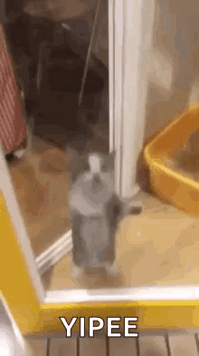

# Hi there, I'm Alex! 👋
I'm a computer engineering student who is passionate about computer architecture, VLSI design, FPGAs, and learning about emerging technologies to one day make a positive impact upon the world.

## 🌱 Current Coursework:
 - Advanced Computer Achitecture
 - Hardware Description Languages in Digital System Design
 - Electronics I
 - Digital Signal Processing
 - Junior Design (Intro to PCB Design)

## 🔭 Actively Working On:
 - RISC/MIPS Single Cycle Datapath verilog design
 - Semi-automated validation techniques (SECDED project)
 

## 🪴 Prior Relevant Coursework:
|Hardware Security & Trusted Circuit Design|Digital Systems|Embedded Systems|
|-|-|-|
|
Linear Circuits I/II|
Computer Science I/II (DSA in C/Java)|
Intro to Discrete Structures|

                                                                 

 If you made it this far, thanks for checking out my profile!

 

<!--
**ajdef/ajdef** is a ✨ _special_ ✨ repository because its `README.md` (this file) appears on your GitHub profile.

Here are some ideas to get you started:

- 🔭 I’m currently working on ...
- 🌱 I’m currently learning ...
- 👯 I’m looking to collaborate on ...
- 🤔 I’m looking for help with ...
- 💬 Ask me about ...
- 📫 How to reach me: ...
- 😄 Pronouns: ...
- ⚡ Fun fact: ...
-->
